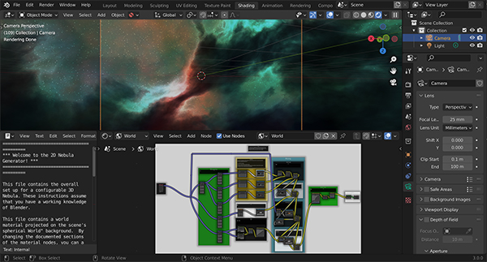

##############
2D Version
##############

The original 2D version of the |Nebula Generator| is still supplied, and still works on the latest versions of Blender.

The 2D |Nebula Generator| .blend file includes instructions on how the file is set up and how to use it. It assumes that you have a beginner/intermediate working knowledge of Blender.

The node works by overlaying a series of different |noise nodes| to produce the clouds and the stars. 

The principles behind the node group is described in this video:

|2D Nebula Tutorial|

.. |2D Nebula Tutorial| raw:: html

    <iframe width="560" height="315" src="https://www.youtube.com/embed/7EtXI4ePzO4" title="YouTube video player" frameborder="0" allow="accelerometer; autoplay; clipboard-write; encrypted-media; gyroscope; picture-in-picture" allowfullscreen></iframe>

.. |this youtube video| raw:: html

   <a href="https://www.youtube.com/watch?v=7EtXI4ePzO4" target="_blank"><b>this video</b></a>

.. |noise nodes| raw:: html

   <a href="https://docs.blender.org/manual/en/latest/render/shader_nodes/textures/noise.html" target="_blank"><b>noise functions</b></a>

.. |Nebula Generator| raw:: html

   <a href="https://blendermarket.com/products/nebula-generator" target="_blank"><b>Nebula Generator</b></a>