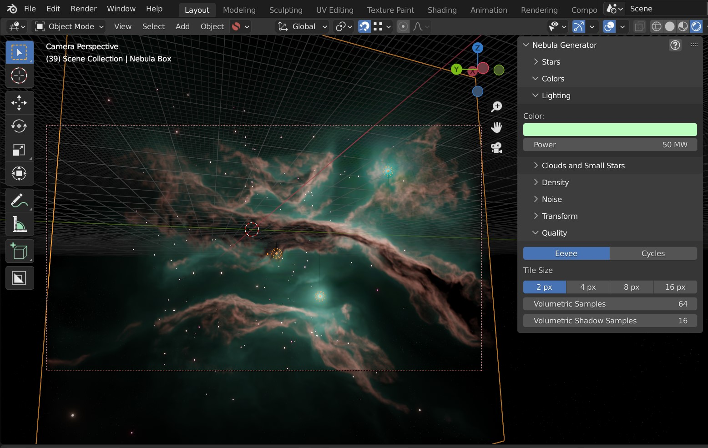
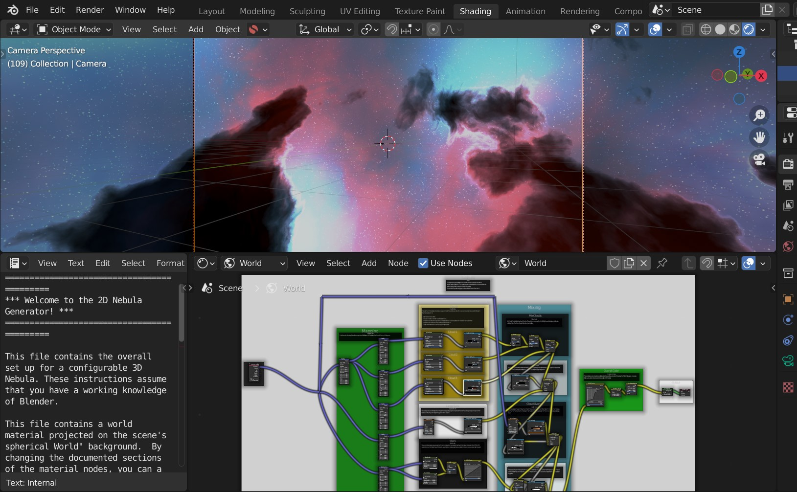

#################
Files
#################

Files: 3D Version
**********************************

The 3D version has two parts:

* **nebula_3d_vX.X.blend**  - the latest version of the 3D Nebula Generator set up.
* **nebula_generator_control_panel.vX.X.install.me.zip**  - the optional :ref:`Control Panel` for the 3D Nebula Generator.

Files: 2D Version
**********************************

The 2D version is all contained in one .blend file:

* **nebula_2d_vX.X.blend** - the latest version of the 2D node group for background effects.

Additional Files
**********************************

* **samples.unzip.me.zip** - a collection of sample files using the 2D and 3D set ups.
* **panoramic_hdri_creation.unzip.me.zip** - a set of sample files configured to create panoramic images for HDRIs.
* **nebula_generator_for_2.92_and_below.unzip.me.zip** - this is a file containing all of the above but with for users of Blender 2.92 and below.