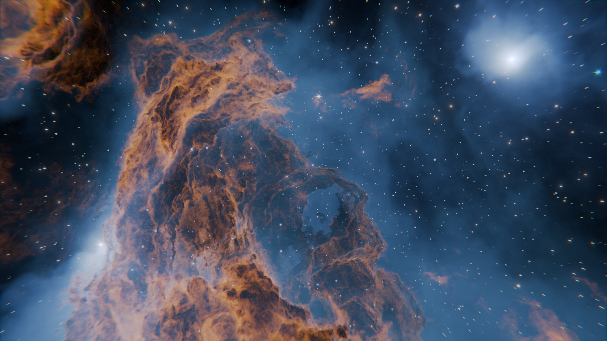

.. Nebula Generator documentation master file, created by
   sphinx-quickstart on Tue Nov 30 17:38:12 2021.
   You can adapt this file completely to your liking, but it should at least
   contain the root `toctree` directive.

Nebula Generator documentation
============================================

.. .. figure:: _static/docs_splash.jpg
..   :alt: Nebula Generator
..   :width: 560

What is the Nebula Generator?
---------------------------------

The |Nebula Generator| is for digital artists to create configurable space nebula effects in 2D or 3D.  Great for concept art, game backgrounds, and animations.

Features
---------------------------------

* You get a ready made |Blender| file setup, additional sample files, and for the 3D version an add-on for controlling the effect through one panel.
* Change the colour and shape of the nebula through a range of options.
* Control the number, position and color of stars and light sources.
* Pan and Zoom around the 3D Nebula set up.
* Animate parameters to make the clouds and stars appear as if they are moving.
* Use in both |Cycles| and |Eevee| Blender render engines.

|add_lib_video|

.. |add_lib_video| raw:: html

    <iframe width="560" height="315" src="https://www.youtube.com/embed/LzkdxKeh0gI" title="YouTube video player" frameborder="0" allow="accelerometer; autoplay; clipboard-write; encrypted-media; gyroscope; picture-in-picture" allowfullscreen></iframe>

.. toctree::
   :maxdepth: 2
   :caption: Contents:

   files
   3D/3d_overview
   2D/2d_overview
   tips/tips
   tips/troubleshooting
   contact/contact

.. |Nebula Generator| raw:: html

   <a href="https://blendermarket.com/products/nebula-generator" target="_blank"><b>Nebula Generator</b></a>

.. |Blender| raw:: html

   <a href="https://www.blender.org/" target="_blank"><b>Blender</b></a>

.. |Cycles| raw:: html

   <a href="https://docs.blender.org/manual/en/latest/render/cycles/introduction.html" target="_blank"><b>Cycles</b></a>

.. |EEVEE| raw:: html

   <a href="https://docs.blender.org/manual/en/latest/render/eevee/introduction.html" target="_blank"><b>Eevee</b></a>