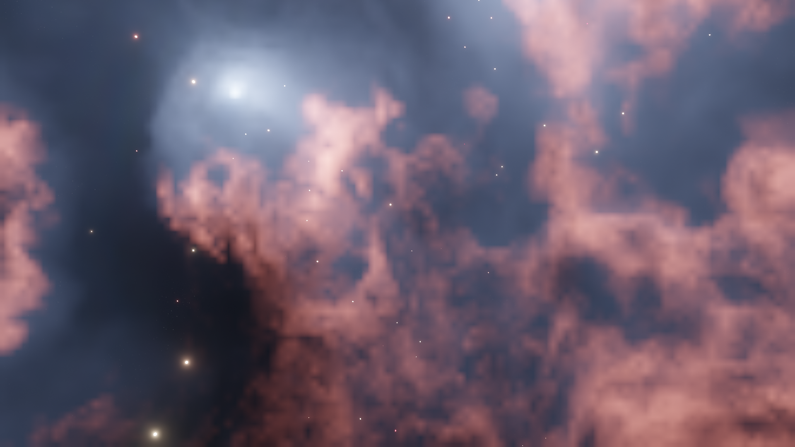

##############
FAQ
##############

********************************************************************
General Questions
********************************************************************

=======================================================================================
When I load the .blend file the viewport is blank. What's happened?
=======================================================================================

You have to change the *viewport shading* mode to "Rendered" by clicking the *viewport shading* button in the top right of the viewport, Blender does not load the *Rendered* viewport shading by default.

.. image:: ../_static/viewport_rendered.jpg
    :alt: Rendered viewport shading

=======================================================================================
How can I control the parameters more slowly when I move the mouse?
=======================================================================================

A neat trick in Blender is the *shift* key - whilst clicking and moving the mouse over a parameter, hold shift.  The values will change more slowly.  Especially for this node group, you can more subtly change the effects.

=================================================================================================================================================
How best can I control the parameters? I've managed to change something so that I'm not getting a good effect. What do you suggest I do?
=================================================================================================================================================

You can click and slide the mouse over multiple parameters and change them all at once - this is useful when you want to change a property on all 3 cloud settings.

Also, by hovering over the parameter box and hitting the *delete* key, the parameter will return to its default value.

There are a set of sample .blend files I have supplied in a .blend file to give you a head start in configuring different effects.  I'm sure you can find more.

=================================================================================================================================================
I have a Mac with an AMD Radeon GPU Pro, and when I load the 3D Nebula Generator I can only see the stars. What's happened?
=================================================================================================================================================

There seems to be an outstanding issue with Blender's EEVEE volumetrics engine and the Mac OS AMD Radeon Pro, described here: https://developer.blender.org/T65873

=======================================================================================
I cannot see the :ref:`control panel` in Blender.
=======================================================================================

    Make sure you have done the following:

    * Make sure the :ref:`panel is installed<Installing the Panel>`.
    * The panel will only open with one of the Nebula Generator files with the 'Nebula Box' object in it.
    * If you cannot see any of the side panels on the right, pressed the 'N' which should make them appear.

============================
Any general tips?
============================

* Activate the built in Node Wrangler add-on and hold SHIFT-CTRL and click on a node to see the individual effect of each node.  This will help understand how the different parts of the effect is made up.
* By adding node groups like noise and musgrave to the inputs of the main node group, you can get lots of additional interest effects.  I'd encourage you to experiment and let me know if you get anything interesting.
* 2D Version
    * I have added a curves node to the outputs of the stars and nebula node groups - playing with those settings will help intensify the colours of the nebula further.
    * Try swapping out the stars input for your own starfields and you should get more interesting effects.
* 3D Version 
    * When changing parameters that have a significant effect or preparing for a render, switch the viewport to Wireframe mode.
    * Start with a high Tile Size and low Samples value, change parameters, and then increase them gradually to get the desired effect.
    * When animating, you will experience strobing effects on the clouds unfortunately in EEVEE. This can be countered with a higher Samples setting but may not be resolved entirely.  It is hoped that EEVEE can be improved to counter this.
    * Although the default renderer is EEVEE, the file can be adapted for CYCLES by changing the rendering format and changing the parameters of the materials.  Even though there will be a significant performance, this removed the strobing artefacts mentioned earlier.

********************************************************************
Should I use Eevee or Cycles?
********************************************************************

You can switch between the Eevee and Cycles render engines at any time in the :ref:`Quality` section of the control panel or in Blender's Render Properties.  Here are some advantages and disadvantages of each render engine to help you choose. 

A possible workflow is to work in Eevee to set up the overall effect, and then switch to Cycles to tailor it further, if needed.

=============================
Eevee
=============================

------------------------------------
Advantages of Eevee
------------------------------------

.. figure:: ../_static/eevee_adv.gif
  :alt: Nebula Generator Controls

* Quickly visualise the effect in the viewport.
* Faster than Cycles.
* Good for medium resolution still shots and backgrounds.

------------------------------------
Disadvantages of Eevee
------------------------------------

|eevee_strobing|

.. |eevee_strobing| raw:: html

    <iframe width="560" height="315" src="https://www.youtube.com/embed/fvZg7gHCcuY" title="YouTube video player" frameborder="0" allow="accelerometer; autoplay; clipboard-write; encrypted-media; gyroscope; picture-in-picture" allowfullscreen></iframe>

* When animating, a strobing effect can occur.  This is because EEVEE converts the nebula to flat 2D cards when rendering.  The Cycles rendering engine does not have this issue.

* Edges of the clouds can appear blurred, which can be sharpened if you either :ref:`decrease the tile size<Decreasing Tile Size>` or :ref:`change Blender's code slightly<Changing Blender codebase for a 1px tile size and higher sample limits>` to set an even smaller tile size than the default.  However there is a limit to how sharp the render will be at high resolutions.

* Intended as a fast preview renderer, Eevee will encounter performance issues at higher >4K resolutions.

* Whilst rendering, Eevee will use your display adapter which will cause general slowdown on your computer.

=============================
Cycles
=============================

------------------------------------
Advantages of Cycles
------------------------------------

.. figure:: ../_static/cycles_adv.jpg
  :alt: Cycles

* Better for animations as it eliminates Eevee's :ref:`strobing effect<Disadvantages of Eevee>`.
* At higher sample settings it will show enhanced detail (at the expense of performance).
* Good for Higher resolution stills and animation.

------------------------------------
Disadvantages of Cycles
------------------------------------

.. figure:: ../_static/cycles_disadv.jpg
  :alt: Cycles

* Slower render times.
* Viewport Preview is slower than Eevee.
* Effect will be slightly different to the Eevee version.
* More settings to consider.
* |Fireflies|, or speckled pixels, will occur which need to be resolved with the |Denoiser|.  See the :ref:`Denoising` section.

.. |Denoiser| raw:: html

    <a href="https://docs.blender.org/manual/en/latest/render/layers/denoising.html" target="_blank"><b>Denoiser</b></a>

.. |fireflies| raw:: html
    
   <a href="https://www.blenderguru.com/articles/7-ways-get-rid-fireflies" target="_blank"><b>Fireflies</b></a>

********************************************************************
How can I improve the Eevee render?
********************************************************************

.. tip::

    There are further hints and tips about which Eevee settings to change in the :ref:`Eevee Quality Settings` section.

=============================
Decreasing Tile Size
=============================

If you decrease Eevee's volumetric |Tile Size| setting to increase the detail seen in the nebula.  This setting is the size of the pixels in a volume:

.. |Tile Size| raw:: html

   <a href="https://docs.blender.org/manual/en/latest/render/eevee/render_settings/volumetrics.html" target="_blank"><b>Tile Size</b></a>

    Tile Size 16px

.. figure:: ../_static/step_size_8px.png
    :alt: Increasing Tile Size
    :width: 100%

    Tile Size 8px

    Tile Size 4px

.. figure:: ../_static/step_size_2px.png
    :alt: Increasing Tile Size
    :width: 100%

    Tile Size 2px

This setting can be found on Blender's Render Properties tab or on the Nebula Generator's :ref:`Control Panel`:

=============================
Increasing samples
=============================

You can also increase the render samples, volumetric samples and volumetric shadow samples settings if you wish to have greater thickness and contrast at the expense of performance.  Increasing the render samples will decrease any speckles in the clouds, especially around light sources.

    64 Volumetric Samples, 16 Shadow Samples (click to enlarge)

.. figure:: ../_static/samples_128_example.png
    :width: 100%

    128 Volumetric Samples, 32 Shadow Samples (click to enlarge)

====================================================================================================================
Changing Blender codebase for a 1px tile size and higher sample limits
====================================================================================================================

.. warning::

    Advanced users only!  This will require some knowledge of building Blender, altering small amounts of code, and may cause Blender to crash in some computer setups.

   Image at 2px Tile Size (click to enlarge)

.. figure:: ../_static/1px_example.png
   :width: 100%

   Slightly sharper image at 1px Tile Size (click to enlarge)

.. image:: ../_static/changing_tile_size.jpg
    :alt: Changing the tile size

At the moment you can decrease Blender's :ref:`tile size<Decreasing Tile Size>` setting to 2px only in the official Blender version.  You can in fact alter Blender's core code to provide you with a 1px option, and make a custom version of Blender from it.  This will give a slightly sharper image than the default 2px, at the expense of memory usage and performance.

To change Blender's code to do this:

#. Follow the instructions to set up |building Blender source code on the command line| from the official website. Choose the instructions according to your operating system.  

    You don't necessarily need to install development tools, as we will be only altering small amounts of code which can be done in a test editor of your choice.  

    Essentially, get to the point where you can build your own Blender with the :code:`make update` and :code:`make` commands.

#. You will now have a copy of Blender's source code in your local directory where you have set up the build.  Find the following file:

    .. code-block:: console

        <blender code directory>\source\blender\makesrna\intern\rna_scene.c

#. Locate the following block of code:

    .. code-block:: c

        static const EnumPropertyItem eevee_volumetric_tile_size_items[] = {
            {2, "2", 0, "2 px", ""},
            {4, "4", 0, "4 px", ""},
            {8, "8", 0, "8 px", ""},
            {16, "16", 0, "16 px", ""},
            {0, NULL, 0, NULL, NULL},
        };
        

#. Add the line :code:`{1, "1", 0, "1 px", ""},` to the start of the variable declaration.  The code block should now look like this:

    .. code-block:: c
        :emphasize-lines: 2

        static const EnumPropertyItem eevee_volumetric_tile_size_items[] = {
            {1, "1", 0, "1 px", ""},
            {2, "2", 0, "2 px", ""},
            {4, "4", 0, "4 px", ""},
            {8, "8", 0, "8 px", ""},
            {16, "16", 0, "16 px", ""},
            {0, NULL, 0, NULL, NULL},
        };

#. **Optional Step:**  You can increase the limit on the volumetric samples and volumetric shadow samples settings in the same file.

    .. warning:: 

       Higher settings here will dramatically increase render time. 

    Change the following lines of code:

    .. code-block:: c

        RNA_def_property_range(prop, 1, 256);
        .
        .
        .
        RNA_def_property_range(prop, 1, 128);

    To this:

    .. code-block:: c

        RNA_def_property_range(prop, 1, 2048);
        .
        .
        .
        RNA_def_property_range(prop, 1, 512);

#. Once the changes are made, go to the command prompt and build blender:

    .. code-block:: console

        make

    .. note::
        If you re-build Blender, especially after a period of time, use the :code:`make clean` and :code:`make update` commands.  See :code:`make help` for further options.

#. When built, navigate to the blender executable to launch Blender.  In Windows, for instance, this will be:

    .. code-block:: console

        build_windows_x64_vc16_Release\bin\Release\blender.exe

#. You should see the 1px tile size option in the drop down options and in the Nebula Generator :ref:`control panel`:

    .. image:: ../_static/1px_control_panel.jpg
        :alt: 1px from the control panel

.. |building Blender source code on the command line| raw:: html

   <a href="https://wiki.blender.org/wiki/Building_Blender" target="_blank"><b>building Blender from the command line</b></a>

********************************************************************
How can I improve the Cycles render?
********************************************************************

.. tip::

    There are further hints and tips about which Cycles settings to change in the :ref:`Cycles Quality Settings` section.

================================
Recommended settings
================================

Key recommended settings in the |Render Properties| are as follows:

* **Noise Threshold** is checked (turns on |Adaptive Sampling|) and set to :code:`0.01000`.
* **Max Samples** *Viewport*: 256 *Render*: 512
* **Denoise** is enabled at render time to remove |fireflies|/speckled in the final render.  Use the **Optix** denoiser of you have an NVidia GPU.
* **Volume Step Rate** is set between 0.1 and 1.0 (lower settings improve thickness and quality).

.. |Render Properties| raw:: html

   <a href="https://docs.blender.org/manual/en/latest/render/cycles/render_settings/index.html" target="_blank"><b>Render Properties</b></a>

.. |Adaptive Sampling| raw:: html

   <a href="https://docs.blender.org/manual/en/latest/render/cycles/render_settings/index.html" target="_blank"><b>Adaptive Sampling</b></a>

================================
Which values to change
================================

    Go to the the :ref:`Cycles Quality Settings` section for further hints and tips.

* The main parameter will be the **Samples** setting under the *Samples* tab of the |Render Properties| section in Blender.  This increases the number of times Cycles calculates a render pass.  Increasing this setting improves the quality and detail, and it is recommended to increase this in multiples of 32 to optimise the computer's memory address size allocation (e.g. 32, 64, 128, 256, 512, 1024).  Higher values will slow render times, however, which can be countered by the use of other settings such as |Adaptive Sampling|.
* Change the |Adaptive Sampling| threshold value tells Cycles to estimate the amount of noise/|fireflies| in an image, and to stop rendering an image tile when it is of a good enough threshold.  Reducing the threshold value makes Cycles more particular at identifying noise/|fireflies| in an image tile.
* Enabling the **Denoiser** will attempt to remove unwanted |fireflies| from the image, but still needs to be used in tandem with higher *samples* settings.  Note that the open source denoiser has occasionally caused crashes.

********************************************************************
How can I create a panoramic skybox?
********************************************************************

.. figure:: ../_static/panoramic_hdri_example.png
    :alt: Panoramic Example

    Panoramic Skybox Example (Cycles Only)

.. warning::

    This works for Cycles only.  Eevee does not have panoramic camera settings at the moment.

You are able to render a panoramic view of the nebula in |Cycles| mode which is useful for creating |HDRIs| and background environments for games:

#. Make you are in |Cycles| rendering mode.
#. Move the camera to the center of your scene (location 0,0,0).
#. Select the camera and go to the 'Object Data Properties' tab on the right hand panel.
#. In the Lens section change the following:

    * **Type**: Panoramic
    * **Panorama Type**: Equirectangular
  
    .. image:: ../_static/pano_settings.jpg
        :alt: Panoramic Example
        

#. You should now be able to view and render a panoramic view in the viewport.

    .. image:: ../_static/pano_viewport.jpg
        :alt: Panoramic Example

.. note::

    .. image:: ../_static/pano_glow_cutoff.jpg
        :alt: Panoramic Example

    As star glow is added to the image afterwards you may notice cut-off glows when the image wraps around a spherical background.  You can address this by either reducing the :ref:`glare effect<Glare Threshold and Mix>` or by correcting the result in an image editor.

.. |HDRIs| raw:: html

   <a href="https://www.adobe.com/creativecloud/file-types/image/raster/hdri-file.html" target="_blank"><b>HDRIs</b></a>

.. |Cycles| raw:: html

   <a href="https://docs.blender.org/manual/en/latest/render/cycles/introduction.html" target="_blank"><b>HDRIs</b></a>
